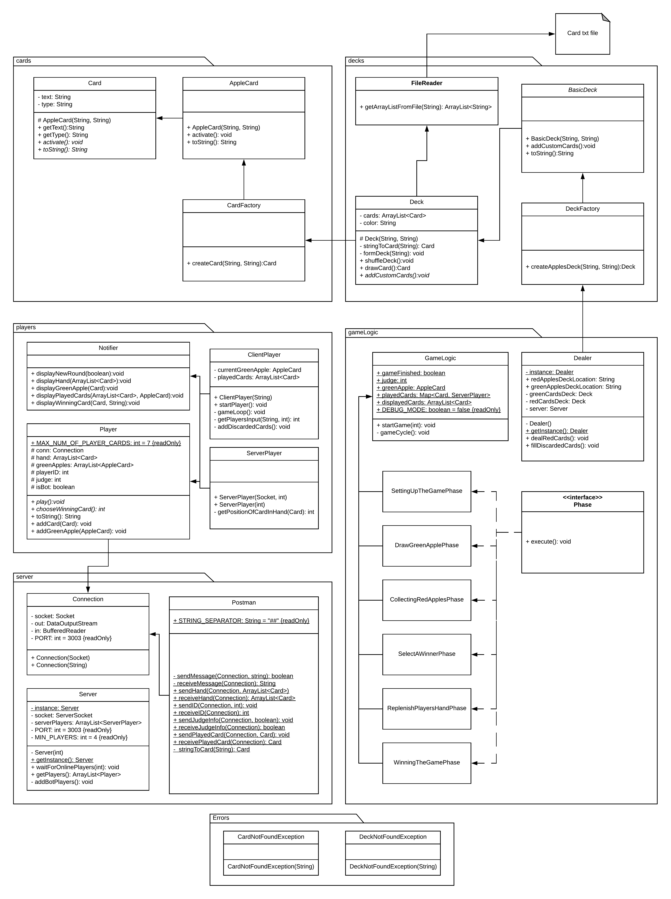
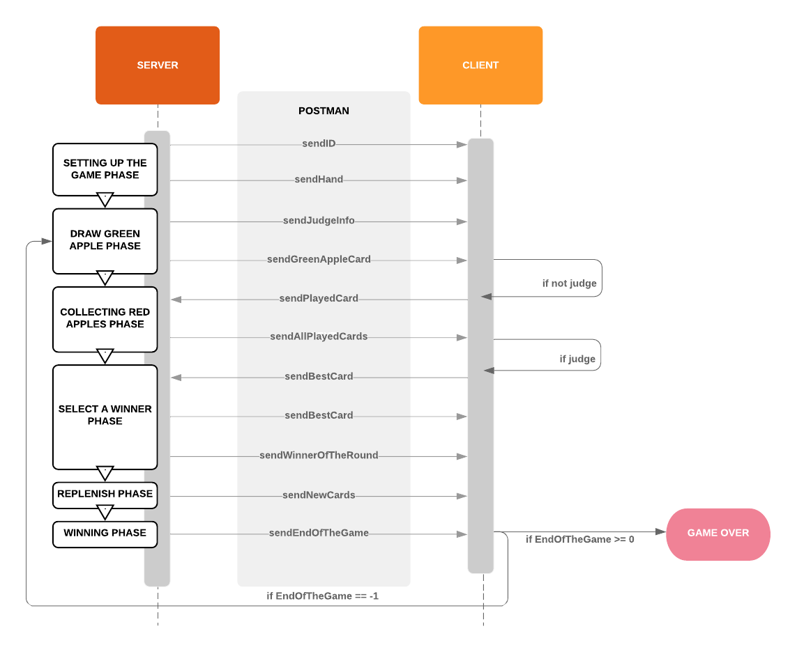

   

# Apples to Apples
Apples to apples is a party game in which players must try and associate an adjective to one of the nouns printed on the
cards held in the player’s hand. A group of players compete to come up with the most amusing association and one player
each round is awarded the point for the best answer. (If you want to turn this game into “Cards against humanity” for your
own amusement it is fine, the rules are similar and the card texts for “Cards against humanity” are available online)
For the rules check this website: [http://www.com-www.com/applestoapples/]((http://www.com-www.com/applestoapples/))

Table of contents
=================
<!--ts-->
* [Apples to Apples](#apples-to-apples)
* [Getting Started](#getting-started)
    * [Prerequisites](#prerequisites)
        * [Java 8](#java-8)
    * [Quick start](#quick-start)
        * [More information](#some-more-information-about-the-start)
* [Testing](#testing)
* [Understanding the code](#understanding-the-code)
<!--te-->

## Getting Started
These instructions will get you a copy of the project up and running on your local machine for development and testing purposes.

### Prerequisites

#### Java 8
Install the latest [JRE 8](https://www.oracle.com/technetwork/java/javase/downloads/index.html) from Oracle.

### Quick start

The source code is provided in the [Apples2Apples.java](https://github.com/ghribar97/Apples2Apples/blob/master/src/main/java/Apples2Apples.java) file

Before using my scripts for running the code you should know that they only works on windows. In case they don't work it is a huge probability that you will have to change JDK_HOME variable in my scripts.

compile with: 
`
javac Apples2Apples.java
 `
 or run [compile.bat](https://github.com/ghribar97/Apples2Apples/compile.bat) from the command prompt (works only on Windows).
 
 and run with:
 `
 java Apples2Apples [Optional: #onlineClients || ipAddress_to_server]
 `
 
 If you compiled the code with the second option you first have to change directory (Apples2Apples.class is now in newly created bin directory).
 
 #### Some more information about the start
 Running without parameters creates 3 bots together with a server player, when
 adding a number as a parameter the server will expect that many instances to connect to the server before starting,
 and specifying an IP address the software will act in online client mode and connect to the specified IP. Note that
 the current software uses ExecutorService which does not exist in earlier versions of Java. Additional files
 with red and green apples texts are available in [greenApples.txt](https://github.com/ghribar97/Apples2Apples/blob/master/greenApples.txt) and [redApples.txt](https://github.com/ghribar97/Apples2Apples/blob/master/redApples.txt)
 
## Testing
There are 2 ways for running the tests.

1. Open your favorite IDE and add [JUnit4.jar](https://github.com/ghribar97/Apples2Apples/lib/org.junit4-4.3.1.jar) among IDE's jars. After that just open [TestRunner](https://github.com/ghribar97/Apples2Apples/blob/master/src/main/test/TestRunner.java) class and run it.
2. Run [unittest.bat](https://github.com/ghribar97/Apples2Apples/unittest.bat) file from the command prompt (works only on windows). Make sure that you have first compiled the code with running the [compile.bat](https://github.com/ghribar97/Apples2Apples/compile.bat) file.

## Understanding the code
For better overview of the code I have also created the following UML diagram of the project:

    

I wanted the code to be as flexible and modifiable as possible.
To understand Server-Client communication here is a Communication Sequence Diagram:

    

[To the top!](#apples-to-apples)